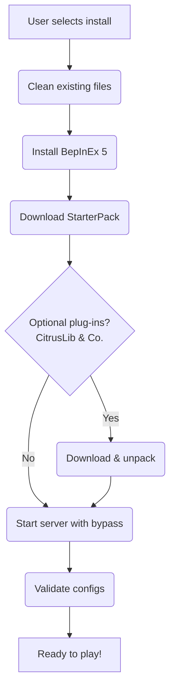

<div align="center">

<pre>
 _____                                                               _____ 
( ___ )-------------------------------------------------------------( ___ )
 |   |                                                               |   | 
 |   |  _____  _    ____   ____      ____                            |   | 
 |   | |_   _|/ \  | __ ) / ___|    / ___|  ___ _ ____   _____ _ __  |   | 
 |   |   | | / _ \ |  _ \| |  _     \___ \ / _ \ '__\ \ / / _ \ '__| |   | 
 |   |   | |/ ___ \| |_) | |_| |     ___) |  __/ |   \ V /  __/ |    |   | 
 |   |  _|_/_/   \_\____/ \____| _  |____/ \___|_|    \_/ \___|_|    |   | 
 |   |                                                               |   | 
  |   |           T A B G   S E R V E R   I N S T A L L E R           |   |  
 |___|                                                               |___| 
(_____)-------------------------------------------------------------(_____) 
</pre>

</div>


*An installer & mod‑loader for **Totally Accurate Battlegrounds** dedicated servers.*

---

## Features

* **One‑click install** – wizard detects your Steam library & sets everything up automatically.
* **BepInEx 5 built‑in** – modern Unity mod loader configured out of the box.
* **StarterPack autoconfig** – downloads the latest release and walks you through its GUI.
* **Community plug‑ins** – optional grab‑and‑go install for *CitrusLib*, *TABGCommunityServer*, and more.
* **Anti‑cheat bypass** – safely disables EAC/EOS on headless servers so mods can load.
* **Self‑healing** – cleans stale files, validates UTF‑8 configs with `ConfigSanitizer`, and keeps everything tidy.

---

## Quick Install & how to use it

1. Download the latest **`TabgInstaller.Gui.zip`** from the [releases page](../../releases).
2. Unzip and double‑click **`TabgInstaller.exe`**.
3. Confirm the detected Steam library path or browse manually.
4. Pick a server name, select optional plug‑ins, and press **Install**.
5. The installer will download everything and set up your files. This may take a minute or two.
6. When the TABG Starter Pack window appears, tweak your default load-out and other options. [Need help configuring Click here!](docs/starter-pack.md)
7. Close the Starter Pack when you’re done—you can reopen it anytime to adjust settings.
8. A separate Configuration window will pop up next. Use it to edit every server parameter.
More details are in the online docs.
9. Switch to the console window and press Start Server.
Ignore the temporary password shown in the console output—log in with the password you chose in step 4. 


### Headless / CI

```powershell
dotnet TabgInstaller.Core.dll \
  --steamDir "D:\SteamLibrary" \
  --serverDir "D:\SteamLibrary\steamapps\common\TotallyAccurateBattlegroundsDedicatedServer" \
  --citrusTag v3.2.0 \
  --installCommunityServer true \
  --skipAntiCheatBypass false
```

---

## Project layout

| Project                             | Type            | Description                                                 |
| ----------------------------------- | --------------- | ----------------------------------------------------------- |
| **ConfigSanitizer**                 | Console         | Fixes bad JSON in *TheStarterPack.json*.                    |
| **TabgInstaller.Core**              | Library         | Handles discovery, download, install & diagnostics.         |
| **TabgInstaller.Gui**               | WPF             | Friendly wizard front‑end with live logs.                   |
| **TabgInstaller.AntiCheatBypass**   | BepInEx plug‑in | Harmony patch that short‑circuits EAC/EOS initialisation.   |
| **TabgInstaller.WeaponSpawnConfig** | BepInEx plug‑in | Runtime loot‑table multiplier (global → category → weapon). |
| **examples/**                       | Samples         | Hello‑world mods & config‑API demos.                        |

---

## Insights



---

## 📄 License

Released under the **MIT License** – see [LICENSE](LICENSE) for the full text.
